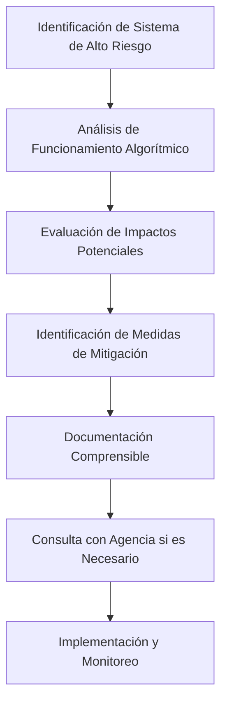

# Análisis Detallado: Partes de la Ley 21719 que Requieren IA Explicable

## Resumen

La **Ley 21719** sobre Protección y Tratamiento de Datos Personales establece múltiples disposiciones que requieren directamente la implementación de **Inteligencia Artificial Explicable (XAI)** para su cumplimiento. Este análisis identifica ocho partes/apartados clave donde la IA Explicable es esencial para satisfacer las obligaciones legales establecidas cuando se utilizan tecnologías de IA.

> **Nota:** Se denominan "partes" o "apartados" a aquellos artículos que contengan alguna relación con XAI.

## Introducción

La **Ley 21.719**, que regula la protección y el tratamiento de los datos personales en Chile, introduce obligaciones específicas relacionadas con:

- El tratamiento automatizado de datos
- La toma de decisiones algorítmicas  
- La elaboración de perfiles

Estos aspectos, al estar directamente ligados a tecnologías de inteligencia artificial, exigen —cuando dichas tecnologías son utilizadas— la adopción de enfoques de **IA Explicable**. Esta es la forma de garantizar el cumplimiento efectivo de derechos fundamentales de los titulares, tales como:

- **Transparencia**
- **Justificación de decisiones**
- **Control sobre sus datos personales**

### ¿Qué es la Inteligencia Artificial Explicable?

La **Inteligencia Artificial Explicable (IAE)**, conocida globalmente como **XAI** por sus siglas en inglés (Explainable Artificial Intelligence), es un enfoque que busca que los sistemas de inteligencia artificial sean comprensibles, transparentes y auditables por personas humanas.

#### Diferencias Clave

| Aspecto | Modelos "Caja Negra" | IA Explicable (XAI) |
|---------|---------------------|---------------------|
| **Transparencia** | No se puede rastrear el proceso de decisión | Permite explicar y justificar el razonamiento |
| **Comprensión** | Opaco e incomprensible | Comprensible y auditable |
| **Aplicabilidad** | Limitada en contextos sensibles | Ideal para salud, banca, justicia, administración pública |

#### Historia y Desarrollo

El término **XAI** fue formalizado y popularizado en **2016**, cuando la agencia **DARPA** (Defense Advanced Research Projects Agency) de Estados Unidos lanzó el programa oficial "Explainable Artificial Intelligence (XAI)", con el objetivo de enfrentar los riesgos que implica confiar en modelos opacos en entornos de alta responsabilidad.

Desde entonces, XAI se ha convertido en una **prioridad** en el diseño ético y regulado de sistemas basados en inteligencia artificial.

#### Referencias Técnicas

- [Explainable AI (XAI) - Macgence](https://es.macgence.com/blog/explainable-ai-xai/)
- [Explainable AI: The Co-pilot for a Collaborative Future](https://dev.to/vaib/explainable-ai-the-co-pilot-for-a-collaborative-future-4enb)
- [XAI Research - AI Multiple](https://research.aimultiple.com/xai/)
- [AWS SageMaker Clarify - Online Explainability](https://docs.aws.amazon.com/sagemaker/latest/dg/clarify-online-explainability.html)

## Apartados Identificados que Requieren "IA Explicable"

### 1. Definición de "Elaboración de Perfiles" (Artículo 2°, letra w)

#### Marco Legal

El **artículo 2°, letra w)** define la elaboración de perfiles como:

> "toda forma de tratamiento automatizado de datos personales que consista en utilizar esos datos para evaluar, analizar o predecir aspectos relativos al rendimiento profesional, situación económica, de salud, preferencias personales, intereses, fiabilidad, comportamiento, ubicación o movimientos de una persona natural."

#### Implicaciones para IA Explicable

Esta definición abarca **directamente** los sistemas de inteligencia artificial que realizan análisis predictivo y evaluación automatizada de personas. Para cumplir con las obligaciones de transparencia y derechos del titular establecidas en la ley, estos sistemas deben ser explicables, permitiendo que los responsables de datos puedan:

- ✅ **Explicar** cómo se realizan las evaluaciones automatizadas
- ✅ **Describir** qué factores influyen en las predicciones
- ✅ **Justificar** las decisiones basadas en estos perfiles
- ✅ **Proporcionar** información comprensible sobre la lógica aplicada

#### Casos de Aplicación

| Sector | Aplicación | Requisito de XAI |
|--------|------------|------------------|
| **Financiero** | Sistemas de scoring crediticio | Explicar factores de aprobación/rechazo |
| **Recursos Humanos** | Algoritmos de selección de personal | Justificar criterios de evaluación |
| **Marketing** | Sistemas de recomendación personalizados | Transparencia en segmentación |
| **Seguros** | Análisis de comportamiento para seguros | Explicar cálculo de primas y riesgos |
| **Gestión de Riesgos** | Evaluaciones automatizadas de riesgo | Documentar metodología de evaluación |

### 2. Tratamiento de Datos Automatizado (Artículo 2°, letra o)

#### Marco Legal

El artículo define el **tratamiento de datos** como:

> "cualquier operación o conjunto de operaciones o procedimientos técnicos, de carácter automatizado o no, que permitan de cualquier forma recolectar, procesar, almacenar, comunicar, transmitir o utilizar datos personales o conjuntos de datos personales."

#### Implicaciones para IA Explicable

Al incluir explícitamente **procedimientos automatizados**, la ley abarca todos los sistemas de IA y machine learning. La IA Explicable es necesaria para:

- 📋 **Documentar** los procedimientos técnicos automatizados utilizados
- 🔍 **Explicar** las operaciones de procesamiento realizadas
- ⚖️ **Justificar** las decisiones sobre recolección y uso de datos
- 🔓 **Proporcionar** transparencia sobre los algoritmos empleados

#### Casos de Aplicación

| Tipo de Sistema | Descripción | Requisito de Explicabilidad |
|----------------|-------------|----------------------------|
| **Procesamiento de Solicitudes** | Sistemas automáticos de evaluación | Documentar criterios y proceso |
| **Clasificación de Datos** | Algoritmos de categorización | Explicar lógica de clasificación |
| **Detección de Fraude** | Sistemas de alerta automática | Justificar alertas generadas |
| **Procesamiento de Documentos** | OCR y análisis automatizado | Transparencia en extracción de datos |

### 3. Principio de Transparencia e Información (Artículo 3°, letra g)

#### Marco Legal

El **artículo 3°, letra g)** establece que:

> "El responsable debe entregar al titular toda la información que sea necesaria para el ejercicio de los derechos que establece esta ley, incluyendo las políticas y las prácticas sobre el tratamiento de los datos personales, las que además deberán encontrarse permanentemente accesibles y a disposición de cualquier interesado de manera precisa, clara, inequívoca y gratuita."

#### Implicaciones para IA Explicable

Este **principio fundamental** requiere transparencia total en el tratamiento de datos, lo que incluye explicar las prácticas de procesamiento automatizado. La IA Explicable es esencial para:

- 📊 **Proporcionar** información precisa y clara sobre algoritmos utilizados
- 📝 **Explicar** las políticas de tratamiento automatizado
- 🌐 **Hacer accesible** la información sobre decisiones algorítmicas
- 👥 **Garantizar** que la información sea comprensible para los titulares

#### Obligaciones Específicas

| Obligación | Descripción | Implementación con XAI |
|------------|-------------|------------------------|
| **Documentación Comprensible** | Procesos de IA en lenguaje claro | Sistemas de explicación automática |
| **Impacto en Titulares** | Cómo afectan los algoritmos | Análisis de impacto explicable |
| **Información Actualizada** | Cambios en sistemas | Notificaciones automáticas de cambios |
| **Lógica de Decisión** | Disponibilidad permanente | Interfaces de consulta en tiempo real |

### 4. Decisiones Individuales Automatizadas (Artículo 8° bis) ⭐ **ARTÍCULO CLAVE**

#### Marco Legal

El **artículo 8° bis** establece que:

> "El titular de datos tiene derecho a oponerse y a no ser objeto de decisiones basadas en el tratamiento automatizado de sus datos personales, incluida la elaboración de perfiles, que produzca efectos jurídicos en él o le afecte significativamente."

Además, establece que:

> "el responsable deberá adoptar las medidas necesarias para asegurar los derechos y libertades del titular, su derecho a la información y transparencia, **el derecho a obtener una explicación**, a la intervención humana, a expresar su punto de vista y a solicitar la revisión de la decisión."

#### Implicaciones para IA Explicable

Este es el **artículo más importante** ya que establece explícitamente el **derecho a obtener una explicación** en decisiones automatizadas. La IA Explicable es **obligatoria** para:

- 🔍 **Proporcionar** explicaciones comprensibles de decisiones automatizadas
- 👤 **Permitir** la intervención humana informada
- 🔄 **Facilitar** la revisión de decisiones algorítmicas
- 🛡️ **Garantizar** transparencia en procesos que afecten significativamente a las personas

#### Casos de Aplicación Obligatoria

| Sector | Aplicación | Impacto | Requisito XAI |
|--------|------------|---------|---------------|
| **Financiero** | Decisiones de aprobación/rechazo de créditos | Alto | Explicación detallada de factores |
| **Recursos Humanos** | Sistemas de selección automatizada de personal | Alto | Justificación de criterios de selección |
| **Sector Público** | Algoritmos de asignación de beneficios sociales | Alto | Transparencia en criterios de elegibilidad |
| **Seguros** | Sistemas de evaluación automatizada de seguros | Medio-Alto | Explicación de cálculo de riesgos |
| **Servicios Públicos** | Decisiones automatizadas en servicios públicos | Variable | Según impacto en el ciudadano |

#### Excepciones que Mantienen la Obligación de Explicabilidad

> **Importante:** Incluso cuando las decisiones automatizadas están permitidas (por contrato, consentimiento o ley), la **obligación de proporcionar explicaciones se mantiene**, requiriendo IA Explicable en **todos los casos**.

#### Derechos Específicos del Titular

| Derecho | Descripción | Implementación con XAI |
|---------|-------------|------------------------|
| **Oposición** | Derecho a oponerse a decisiones automatizadas | Sistema de opt-out con explicación |
| **Explicación** | Derecho a obtener explicación comprensible | Motor de explicaciones en tiempo real |
| **Intervención Humana** | Derecho a revisión humana | Proceso de escalamiento con contexto |
| **Expresar Punto de Vista** | Derecho a aportar información adicional | Sistema de retroalimentación |
| **Revisión** | Derecho a solicitar revisión de la decisión | Proceso de apelación documentado |

### 5. Derecho de Acceso – Información sobre Lógica Aplicada (Artículo 5°, letra f)

#### Marco Legal

El **artículo 5°, letra f)** establece que el titular tiene derecho a obtener:

> "La información significativa sobre la lógica aplicada en el caso de que el responsable realice tratamiento de datos de conformidad con el artículo 8° bis."

#### Implicaciones para IA Explicable

Este artículo **complementa el artículo 8° bis** al establecer específicamente que los titulares tienen derecho a conocer la lógica aplicada en decisiones automatizadas. La IA Explicable es necesaria para:

- 🧠 **Proporcionar** información significativa sobre algoritmos utilizados
- 📖 **Explicar** la lógica de decisión de manera comprensible
- 📋 **Documentar** los factores considerados en las decisiones automatizadas
- 👁️ **Permitir** que los titulares entiendan cómo se procesan sus datos

#### Requisitos Técnicos

| Requisito | Descripción | Implementación |
|-----------|-------------|----------------|
| **Explicaciones en Tiempo Real** | Capacidad de generar explicaciones inmediatas | APIs de explicación automática |
| **Reportes Comprensibles** | Documentos sobre lógica aplicada | Generadores de reportes técnicos |
| **Trazabilidad** | Seguimiento de decisiones algorítmicas | Logs detallados de decisiones |
| **Personalización** | Explicaciones según caso específico | Motores de explicación contextual |

#### Información Significativa Requerida

La ley exige **"información significativa"**, lo que implica:

- **Nivel de Detalle Apropiado:** No solo información técnica, sino comprensible
- **Relevancia:** Información que realmente ayude a entender la decisión
- **Accesibilidad:** Presentada de manera que el titular pueda comprenderla
- **Completitud:** Suficiente para ejercer otros derechos efectivamente

### 6. Deber de Información sobre Decisiones Automatizadas (Artículo 14 ter, letra l)

#### Marco Legal

El **artículo 14 ter, letra l)** establece la obligación de informar sobre:

> "La existencia de decisiones automatizadas, incluida la elaboración de perfiles. En tales casos, información significativa sobre la lógica aplicada, así como las consecuencias previstas de dicho tratamiento para el titular."

#### Implicaciones para IA Explicable

Este artículo establece **tres obligaciones específicas** que requieren IA Explicable:

1. **Informar sobre la existencia de decisiones automatizadas**
   - Requiere transparencia sobre el uso de sistemas de IA
   
2. **Proporcionar información significativa sobre la lógica aplicada**
   - Necesita explicaciones comprensibles de los algoritmos
   
3. **Explicar las consecuencias previstas**
   - Requiere análisis de impacto explicable

#### Obligaciones Operativas

| Obligación | Descripción | Herramientas XAI Necesarias |
|------------|-------------|----------------------------|
| **Documentación Automática** | Sistemas que registren decisiones | Logs automáticos con explicaciones |
| **Explicación de Consecuencias** | Análisis de impacto comprensible | Modelos predictivos de impacto |
| **Información Actualizada** | Cambios en la lógica | Sistemas de notificación automática |
| **Explicaciones Proactivas** | No solo reactivas a solicitudes | Interfaces de transparencia continua |

#### Casos de Aplicación Práctica

| Contexto | Implementación | Ejemplo |
|----------|----------------|---------|
| **Políticas de Privacidad** | Incluir explicaciones de IA | "Nuestro sistema de recomendaciones utiliza..." |
| **Notificaciones** | Alertas sobre uso de sistemas automatizados | "Esta decisión fue tomada automáticamente porque..." |
| **Documentación Técnica** | Información accesible para usuarios | Sección FAQ sobre algoritmos utilizados |
| **Sistemas de Alerta** | Notificaciones sobre decisiones automatizadas | "Se aplicó un algoritmo que consideró..." |

### 7. Principio de Responsabilidad (Artículo 3°, letra e)

#### Marco Legal

El **artículo 3°, letra e)** establece que:

> "Quienes realicen tratamiento de los datos personales serán legalmente responsables del cumplimiento de los principios contenidos en este artículo y de las obligaciones y deberes de conformidad a la ley."

#### Implicaciones para IA Explicable

Este principio establece la **responsabilidad legal** del cumplimiento de todos los principios, incluyendo transparencia. La IA Explicable es fundamental para:

- ✅ **Demostrar** el cumplimiento de las obligaciones de transparencia
- 📊 **Proporcionar** evidencia del funcionamiento correcto de sistemas automatizados
- 🔍 **Facilitar** auditorías y verificaciones de cumplimiento
- ⚖️ **Permitir** la rendición de cuentas sobre decisiones algorítmicas

#### Obligaciones de Accountability

| Área | Requisito | Implementación con XAI |
|------|-----------|------------------------|
| **Monitoreo** | Sistemas de supervisión continua | Dashboards de explicabilidad |
| **Registros** | Documentación de explicaciones proporcionadas | Bases de datos de explicaciones |
| **Auditoría Interna** | Capacidades de verificación | Herramientas de auditoría automática |
| **Mejora Continua** | Procesos de optimización | Métricas de calidad de explicaciones |

#### Evidencia de Cumplimiento

Para demostrar responsabilidad, las organizaciones deben mantener:

- **Registros de Explicaciones:** Documentación de todas las explicaciones proporcionadas
- **Métricas de Calidad:** Indicadores de efectividad de las explicaciones
- **Procesos de Mejora:** Evidencia de optimización continua
- **Capacitación:** Registros de formación del personal en XAI

### 8. Evaluación de Impacto en Protección de Datos (Artículo 15 ter) ⭐ **ARTÍCULO CLAVE**

#### Marco Legal

El **artículo 15 ter** establece que cuando un tratamiento pueda producir **alto riesgo** para los derechos de los titulares, se debe realizar una evaluación de impacto. Específicamente requiere evaluación en casos de:

> "Evaluación sistemática y exhaustiva de aspectos personales de los titulares de datos, basadas en tratamiento o decisiones automatizadas, como la elaboración de perfiles, y que produzcan en ellos efectos jurídicos significativos."

#### Implicaciones para IA Explicable

Este artículo requiere evaluaciones de impacto específicamente para sistemas de IA que realicen:

- 🔍 **Evaluaciones sistemáticas y exhaustivas** de personas
- 🤖 **Decisiones automatizadas**
- 👤 **Elaboración de perfiles**
- ⚖️ **Que produzcan efectos jurídicos significativos**

#### Requisitos para la Evaluación de Impacto

Para realizar estas evaluaciones adecuadamente, es necesario implementar IA Explicable para:

| Objetivo | Descripción | Herramientas XAI Necesarias |
|----------|-------------|----------------------------|
| **Evaluar Riesgos** | Entender cómo los algoritmos pueden afectar a los titulares | Análisis de impacto explicable |
| **Documentar Lógica** | Explicar el funcionamiento de sistemas automatizados | Documentación técnica comprensible |
| **Identificar Mitigación** | Desarrollar salvaguardas basadas en comprensión del sistema | Modelos de riesgo explicables |
| **Facilitar Consulta** | Proporcionar información técnica comprensible a la Agencia | Reportes regulatorios detallados |

#### Elementos Específicos que Requieren IA Explicable

| Elemento | Descripción | Implementación |
|----------|-------------|----------------|
| **Operaciones de Tratamiento** | Descripción detallada de procesos automatizados | Documentación de flujos algorítmicos |
| **Necesidad y Proporcionalidad** | Evaluación de justificación de decisiones automatizadas | Análisis costo-beneficio explicable |
| **Análisis de Riesgos** | Comprensión del funcionamiento algorítmico | Modelos de riesgo transparentes |
| **Medidas de Mitigación** | Salvaguardas informadas por explicabilidad | Controles basados en comprensión del sistema |

#### Proceso de Evaluación de Impacto con XAI

## Síntesis de Obligaciones

### Obligaciones Inmediatas que Requieren IA Explicable

| Obligación | Artículo | Descripción | Urgencia |
|------------|----------|-------------|----------|
| **Derecho a Explicación** | Art. 8° bis | Obligatorio en todas las decisiones automatizadas | 🔴 **Alta** |
| **Información sobre Lógica** | Art. 5° f | Debe proporcionarse cuando se solicite | 🟡 **Media** |
| **Transparencia Proactiva** | Art. 14 ter l | Información sobre decisiones automatizadas disponible | 🟡 **Media** |
| **Evaluaciones de Impacto** | Art. 15 ter | Requeridas para sistemas de alto riesgo | 🔴 **Alta** |

### Principios Transversales

| Principio | Descripción | Implementación con XAI |
|-----------|-------------|------------------------|
| **Transparencia** | Toda información debe ser precisa, clara e inequívoca | Explicaciones comprensibles y precisas |
| **Responsabilidad** | Los responsables deben poder demostrar cumplimiento | Sistemas de auditoría y documentación |
| **Proporcionalidad** | Las medidas deben ser adecuadas al riesgo | Niveles de explicación según criticidad |
| **Accesibilidad** | Información disponible de manera gratuita y permanente | Interfaces de consulta continua |

## Recomendaciones Prácticas para Implementar IA Explicable

### 1. Implementación Técnica

#### Sistemas de Explicación en Tiempo Real

- ⚡ **Generación Automática:** Capacidades de explicación instantánea
- 🖥️ **Interfaces de Usuario:** Acceso fácil a explicaciones
- 📋 **Documentación Automática:** Registro de todas las decisiones
- 🔌 **APIs de Consulta:** Servicios para consulta de lógica aplicada

#### Niveles de Explicación

| Nivel | Audiencia | Características | Ejemplo |
|-------|-----------|----------------|---------|
| **Técnico** | Auditores, evaluaciones de impacto | Detalle algorítmico completo | Pesos de características, métricas de rendimiento |
| **Usuario** | Titulares de datos | Comprensible, lenguaje natural | "Su solicitud fue rechazada porque..." |
| **Regulatorio** | Agencia, cumplimiento | Formal, estructurado | Reportes de cumplimiento normativo |
| **Contextual** | Según decisión y consecuencias | Adaptado al impacto | Más detalle para decisiones de alto impacto |

### 2. Procesos Organizacionales

#### Governance de IA Explicable

- 📋 **Políticas Internas:** Establecer marcos de explicabilidad
- 👥 **Roles y Responsabilidades:** Definir quién gestiona explicaciones
- 🔄 **Procesos de Revisión:** Actualización continua de explicaciones
- 📞 **Protocolos de Respuesta:** Procedimientos para solicitudes de información

#### Capacitación y Cultura

| Área | Objetivo | Actividades |
|------|---------|-------------|
| **Equipos Técnicos** | Dominio de técnicas XAI | Cursos especializados, certificaciones |
| **Atención al Cliente** | Explicaciones básicas | Capacitación en comunicación de IA |
| **Cultura Organizacional** | Transparencia algorítmica | Workshops, políticas internas |
| **Métricas de Calidad** | Evaluación de explicaciones | KPIs de satisfacción y comprensión |

### 3. Cumplimiento Regulatorio

#### Documentación Requerida

- 📄 **Políticas de Tratamiento:** Información sobre IA incluida
- 🔧 **Procedimientos de Derechos:** Ejercicio de derechos relacionados con decisiones automatizadas
- 📊 **Evaluaciones de Impacto:** Para sistemas de alto riesgo
- 📝 **Registros de Explicaciones:** Documentación de explicaciones proporcionadas

#### Monitoreo y Auditoría

| Actividad | Frecuencia | Objetivo | Herramientas |
|-----------|------------|----------|--------------|
| **Monitoreo Continuo** | Permanente | Supervisión de explicabilidad | Dashboards en tiempo real |
| **Auditorías Periódicas** | Trimestral/Anual | Calidad de explicaciones | Herramientas de evaluación |
| **Métricas de Satisfacción** | Mensual | Efectividad para titulares | Encuestas, feedback |
| **Registros de Cumplimiento** | Permanente | Demostrar cumplimiento ante Agencia | Bases de datos de auditoría |

## Sectores y Casos de Uso Prioritarios

### 1. Sector Financiero

| Aplicación | Requisito XAI | Implementación |
|------------|---------------|----------------|
| **Scoring Crediticio** | Explicación de factores de aprobación/rechazo | Modelos interpretables, SHAP values |
| **Detección de Fraude** | Justificación de alertas y bloqueos | Explicaciones en tiempo real |
| **Seguros** | Explicación de cálculo de primas y riesgos | Transparencia en evaluación de riesgos |
| **Inversiones** | Transparencia en algoritmos de recomendación | Explicación de estrategias automatizadas |

### 2. Sector Público

| Aplicación | Requisito XAI | Implementación |
|------------|---------------|----------------|
| **Beneficios Sociales** | Explicación de criterios automatizados | Sistemas de transparencia ciudadana |
| **Sistemas de Justicia** | Transparencia en herramientas de apoyo | Explicaciones para decisiones judiciales |
| **Servicios de Salud** | Explicación de triaje y diagnóstico asistido | IA médica explicable |
| **Educación** | Transparencia en asignación y evaluación | Algoritmos educativos transparentes |

### 3. Sector Privado

| Aplicación | Requisito XAI | Implementación |
|------------|---------------|----------------|
| **Recursos Humanos** | Explicación de selección automatizada | Transparencia en procesos de contratación |
| **Marketing** | Transparencia en segmentación y targeting | Explicación de personalización |
| **E-commerce** | Explicación de recomendaciones y precios | Algoritmos de recomendación transparentes |
| **Telecomunicaciones** | Transparencia en gestión de red y servicios | Explicación de decisiones de servicio |

## Desafíos y Consideraciones

### 1. Desafíos Técnicos

| Desafío | Descripción | Soluciones Propuestas |
|---------|-------------|----------------------|
| **Complejidad Algorítmica** | Modelos muy complejos difíciles de explicar | Técnicas de aproximación, modelos sustitutos |
| **Escalabilidad** | Explicaciones para millones de decisiones | Sistemas automatizados de explicación |
| **Tiempo Real** | Explicaciones instantáneas | Precálculo, explicaciones aproximadas |
| **Precisión vs. Comprensibilidad** | Balance entre exactitud y simplicidad | Niveles múltiples de explicación |

### 2. Desafíos Organizacionales

| Desafío | Descripción | Soluciones Propuestas |
|---------|-------------|----------------------|
| **Capacitación** | Personal no familiarizado con XAI | Programas de formación estructurados |
| **Costos** | Inversión en nuevas tecnologías | ROI basado en cumplimiento y confianza |
| **Resistencia al Cambio** | Reluctancia a adoptar transparencia | Gestión del cambio, beneficios claros |
| **Integración** | Incorporar XAI en sistemas existentes | Migración gradual, APIs compatibles |

### 3. Consideraciones Legales

| Aspecto | Consideración | Recomendación |
|---------|---------------|---------------|
| **Interpretación Legal** | Definición de "explicación significativa" | Consulta con expertos legales |
| **Responsabilidad** | Quién responde por explicaciones incorrectas | Marcos de responsabilidad claros |
| **Evolución Normativa** | Cambios futuros en regulación | Sistemas flexibles y adaptables |
| **Cumplimiento Internacional** | Coherencia con GDPR y otras normas | Estándares internacionales |

## Conclusiones y Próximos Pasos

### Conclusiones Clave

1. **Obligatoriedad:** La Ley 21719 hace **obligatoria** la implementación de IA Explicable para sistemas que tomen decisiones automatizadas que afecten significativamente a las personas.

2. **Alcance Amplio:** Los requisitos abarcan desde la **elaboración de perfiles** hasta las **evaluaciones de impacto**, cubriendo prácticamente todos los usos de IA en el tratamiento de datos personales.

3. **Derechos Específicos:** Los titulares tienen **derechos explícitos** a obtener explicaciones comprensibles de las decisiones automatizadas que les afecten.

4. **Responsabilidad Legal:** Las organizaciones deben poder **demostrar cumplimiento** a través de sistemas de IA explicable y documentación adecuada.

### Próximos Pasos Recomendados

#### Inmediatos (0-3 meses)
- 🔍 **Auditoría de Sistemas:** Identificar todos los sistemas de IA que requieren explicabilidad
- 📋 **Evaluación de Brecha:** Determinar qué sistemas no cumplen actualmente
- 👥 **Formación de Equipo:** Establecer equipo responsable de implementación XAI
- 📊 **Evaluaciones de Impacto:** Realizar para sistemas de alto riesgo

#### Corto Plazo (3-6 meses)
- 🛠️ **Implementación Técnica:** Desarrollar capacidades de explicación básicas
- 📝 **Documentación:** Crear políticas y procedimientos de explicabilidad
- 🎓 **Capacitación:** Formar personal en técnicas y herramientas XAI
- 🔧 **Sistemas de Monitoreo:** Implementar supervisión continua

#### Mediano Plazo (6-12 meses)
- 🚀 **Despliegue Completo:** Implementar XAI en todos los sistemas requeridos
- 📈 **Optimización:** Mejorar calidad y eficiencia de explicaciones
- 🔄 **Procesos Maduros:** Establecer procesos operativos completos
- ✅ **Verificación de Cumplimiento:** Auditoría completa de cumplimiento

#### Largo Plazo (12+ meses)
- 🔄 **Mejora Continua:** Optimización basada en experiencia y feedback
- 🌐 **Expansión:** Aplicar XAI a nuevos sistemas y casos de uso
- 📊 **Métricas Avanzadas:** Desarrollar KPIs sofisticados de explicabilidad
- 🚀 **Innovación:** Explorar nuevas técnicas y tecnologías XAI

---

> **Nota Final:** La implementación de IA Explicable no es solo un requisito legal, sino una **oportunidad** para mejorar la confianza, transparencia y calidad de los sistemas de inteligencia artificial. Las organizaciones que adopten proactivamente estos principios estarán mejor posicionadas para el futuro regulatorio y competitivo.

